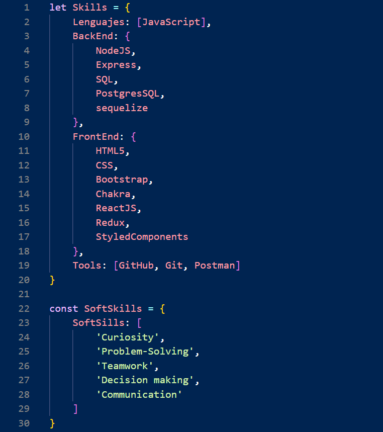

  

 

 

## 👋 Hi, I’m @AntonelaRodriguez
- My name is Antonela Belen Rodriguez and I'm Full Stack Developer 🚀
- 🧠 I'm currently interested on start working in the industry.
- 🔭 I recently finished my final project to finish Henry Bootcamp.
- 📫 How to reach me on Email at [Antonela Rodriguez](antonelabelenrodriguez@gmail.com) 
- My portfolio [here](https://portfolio-web-lemon.vercel.app/) 

 

## Hard Skills and Soft-Skills

   

## Connect with me  

  

  
  

   

## Github Stats  

  

   